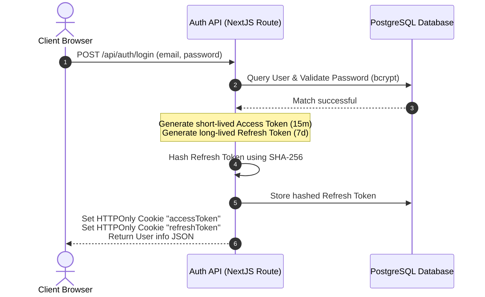
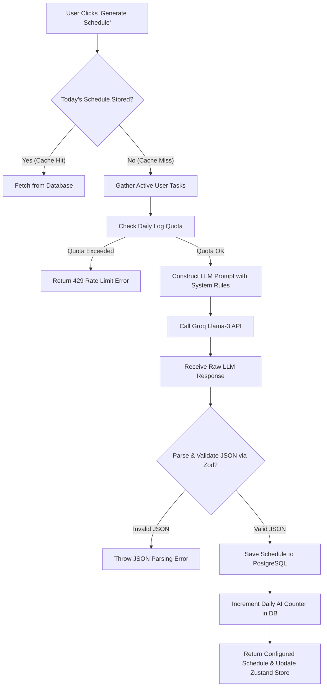

# FocusAI — Intelligent Productivity & Daily Schedule Planner

FocusAI is an industry-grade, full-stack productivity workspace that combines task management with AI-powered schedule optimization. By analyzing task priorities, deadlines, estimated duration, and cognitive energy levels, FocusAI utilizes a Llama-3 model via Groq SDK to auto-generate a structured, chronological daily schedule.

---

## 🚀 Key Features

- **Smart Task Management**: Add, modify, delete, and categorize tasks with rich metadata (deadlines, priorities, estimated minutes, and required energy level from 1 to 5).
- **AI Daily Schedule Generation**: Instantly maps out an optimized timeline of task blocks and breaks using a custom LLM prompt, ensuring high-priority and high-energy tasks are placed early.
- **Performance & Coaching Analytics**: Dynamic metrics tracking active work units, task completion rates, and personalized daily AI coaching reviews.
- **Robust Security & Auth**: Implements custom JWT authentication with automatic refresh token rotation (stored securely as SHA-256 hashes in the database) and HTTPOnly cookies.
- **Optimized AI API Calls**: Integrates a fetch-first caching approach, only hitting the AI generation endpoint if requested by the user or if no schedule has been generated yet for the current day.

---

## 🛠️ Tech Stack

### Frontend
- **React 19 & Next.js 16 (App Router)**: Hybrid server-client rendering and file-based API routing.
- **Zustand 5**: Ultra-lightweight, reactive global state stores.
- **Axios**: Configured client with automatic JWT token insertion and credentials support.
- **Tailwind CSS 4**: Modern styling utility classes and variables.

### Backend
- **Next.js API Route Handlers**: Decoupled, modular CRUD routes.
- **Prisma ORM**: Type-safe query building and database modeling.
- **PostgreSQL**: Scalable database layer hosted on Neon.
- **Groq SDK**: Connects to the `llama-3.3-70b-versatile` engine for sub-second schedule generation.
- **jsonwebtoken & bcryptjs**: Password hashing and secure token signatures.

---

## 📁 Project Architecture

```text
my-app/
├── components/             # Reusable UI layout elements & cards
│   ├── layout/             # Sidebar, Navbar, and Mobile Navigation
│   └── ui/                 # Atomic components (Button, Input, Card, Badge)
├── prisma/                 # Prisma config, Schema definition, Migrations
├── src/
│   ├── app/                # Next.js App Router folders and routes
│   │   ├── (dashboard)/    # Layout-wrapped routes: dashboard, tasks, schedule, stats
│   │   ├── api/            # API Route handlers (Auth, Tasks, Schedules)
│   │   └── page.tsx        # Auth page root mount
│   ├── features/           # Frontend feature modules (e.g., auth pages, fetch layers)
│   ├── lib/                # Shared connectors (axios, prisma, groq, prompts)
│   ├── schema/             # Zod validation schemas
│   ├── services/           # Backend database queries and logic
│   ├── store/              # Zustand global states (authStore, taskStore, aiGenrateStore)
│   ├── types/              # Unified TypeScript definitions
│   ├── utils/              # Token utilities & auth verifications
│   └── proxy.ts            # Next.js 16 route protection guard
└── README.md               # Documentation
```

---

## ⚙️ Configuration & Setup

### 1. Prerequisites
Ensure you have **Node.js (v18+)** and **npm** or **bun** installed.

### 2. Install Dependencies
```bash
npm install
```

### 3. Setup Environment Variables
Create a `.env` file in the project root:
```env
# Database connection (hosted Neon Postgres recommended)
DATABASE_URL="postgresql://neondb_owner:npg_...xxx.../neondb?sslmode=require"

# JWT Signatures
ACCESS_TOKEN_SECRET="your-strong-access-token-secret"
ACCESS_TOKEN_EXPIRES_IN="15m"
REFRESH_TOKEN_SECRET="your-strong-refresh-token-secret"
REFRESH_TOKEN_EXPIRES_IN="7d"

# Third-party Integrations
GROQ_API_KEY="gsk_..."
```

### 4. Database Setup & Sync
Generate the Prisma client:
```bash
npx prisma generate
```
Apply migrations to sync your schema with PostgreSQL:
```bash
npx prisma migrate dev
```

### 5. Run the Application
Start the development server:
```bash
npm run dev
```
Open [http://localhost:3000](http://localhost:3000) to view the application.

---

## 🧠 System Architecture Flows

### 1. Secure Authentication Flow (JWT & Refresh Token Rotation)



### 2. AI Schedule Generation Flow with Validation



---

## 🎓 Technical Interview Study Guide & Q&A

This section is structured to serve as a high-yield interview preparation module. It connects the engineering decisions made in FocusAI with core software engineering concepts frequently tested in Senior and Mid-Level Fullstack developer roles.

---

### Topic 1: Authentication Architecture & Session Security

FocusAI uses dual-token JWT authentication (short-lived Access Tokens, long-lived Refresh Tokens) utilizing HTTPOnly, Secure, SameSite Lax cookies with Refresh Token Rotation (RTR).

#### Q1: What is Refresh Token Rotation (RTR) and why is it preferred over static refresh tokens?
> [!NOTE]
> **Answer**: Refresh Token Rotation is a security pattern where the server issues a new refresh token every time a client requests a new access token using a refresh token. At the same time, the previously used refresh token is invalidated.
> 
> **Why it's preferred**: RTR mitigates the risk of **Token Replay Attacks**. If a malicious actor intercepts a refresh token and attempts to replay it, the server will detect that a previously invalidated refresh token is being used. Under strict RTR protocol (which FocusAI implements), this is treated as a severe security breach: the server automatically invalidates the entire chain of refresh tokens associated with that user, forcing all active sessions to log out and protect the user.

#### Q2: Why store SHA-256 hashes of refresh tokens in the database rather than storing them in plain text?
> [!NOTE]
> **Answer**: This is a defense-in-depth strategy. If an attacker gains read access to the database (via SQL injection, backup exposure, etc.), plain-text refresh tokens would allow them to bypass credentials checks and instantly hijack user accounts by forging access tokens. By hashing refresh tokens with SHA-256 and only storing the `tokenHash` in the `refresh_tokens` table, we ensure that compromised database values cannot be used directly by attackers. The server performs the SHA-256 hash operation on the client's cookie value upon request and matches the hash in the database, preserving the secret.

#### Q3: Explain the security trade-offs between storing tokens in browser memory vs. `localStorage` vs. `HTTPOnly` cookies.
> [!NOTE]
> **Answer**:
> - **localStorage / sessionStorage**: Highly vulnerable to **Cross-Site Scripting (XSS)**. Any malicious script or dependency injected into the page can access `localStorage.getItem("token")` and exfiltrate it.
> - **In-Memory**: Highly secure against XSS (cannot be trivially read by scripts outside the scope), but the token is lost on page refresh, causing poor user experience.
> - **HTTPOnly, Secure Cookies**: Safe from XSS because client-side JavaScript cannot access the cookies (`document.cookie` is empty). However, cookies are vulnerable to **Cross-Site Request Forgery (CSRF)**. FocusAI counters this by utilizing the `sameSite: "lax"` attribute, which prevents the browser from attaching cookies on cross-site requests, protecting against CSRF attacks.

---

### Topic 2: State Management & Component Re-renders (Zustand)

FocusAI implements Zustand for global state management instead of React Context API or Redux.

#### Q1: How does Zustand solve the React Context "Provider Hell" and performance issues?
> [!IMPORTANT]
> **Answer**:
> 1. **Render Cascading**: In React Context, when a provider value changes, *all* components consuming that Context are re-rendered, regardless of whether they actually use the modified field. In Zustand, components subscribe to changes reactively. Re-renders only trigger if the selector value they are listening to has changed.
> 2. **Provider Hell**: Context requires nesting components inside `<MyContext.Provider>` wrappers. In a complex app, this leads to deep component trees. Zustand is decoupled from the component tree. You instantiate stores globally and hook directly into them without DOM nesting.
> 3. **Boilerplate**: Unlike Redux, which requires actions, reducers, types, and dispatch hooks, Zustand uses simple callback-based set functions, reducing code complexity by over 60%.

#### Q2: What is the purpose of selectors in state management, and how do we write optimized selectors in Zustand?
> [!IMPORTANT]
> **Answer**: Selectors allow a component to subscribe only to a sliced portion of the global state:
> ```typescript
> // Only triggers re-render when 'tasks' array changes, ignoring auth state changes
> const tasks = useTaskStore((state) => state.tasks);
> ```
> If we did `const state = useTaskStore()`, the component would re-render whenever *any* state variable in `useTaskStore` (like `isLoading`, `error`, `editingTask`) was updated. By slicing state, we maintain high performance.

#### Q3: What is Next.js Hydration Mismatch, and how does it relate to client-state stores?
> [!IMPORTANT]
> **Answer**: Next.js pre-renders HTML on the server. The client then "hydrates" it by running React to match the DOM. If a Zustand store initiates state based on local storage or window properties (e.g. reading a token from `localStorage` immediately on initial load), the server-rendered HTML (which doesn't have local storage) will differ from the client's initial render. This triggers a Hydration Mismatch error.
> 
> We solve this in FocusAI by:
> 1. Ensuring state initializations do not execute client-only APIs on the server.
> 2. Returning loading/skeleton screens or delaying client-specific UI rendering using React `useEffect` or state signals (`isMounted`), ensuring the first paint matches the server structure.

---

### Topic 3: Next.js 16 App Routing & Route Guards

Next.js 16 deprecates standard `middleware.ts` in favor of a specialized proxy pipeline (`src/proxy.ts`).

#### Q1: What is the proxy pattern in routing, and how does Next.js 16 route guarding work?
> [!TIP]
> **Answer**: The routing proxy pattern acts as a gatekeeper intercepting HTTP requests before they reach Next.js page renders or API route handlers. In Next.js 16, `src/proxy.ts` evaluates incoming `NextRequest` objects. By matching pathnames (using regex or matcher configurations) against lists of `protectedRoutes`, the proxy checks for the presence of the `accessToken` HTTPOnly cookie. If missing, it uses `NextResponse.redirect` to abort the load and redirect to the login page (`/`). This ensures authorization checks occur on the edge/server level before code execution, maximizing performance and security.

#### Q2: Why is route guarding on the server/proxy level safer than route guarding on the client level?
> [!TIP]
> **Answer**: Client-side route guarding (e.g. checking `isAuthenticated` inside a React component `useEffect` and redirecting with `router.push`) allows the client browser to download, execute, and potentially expose the JavaScript bundle, assets, and layout structures of a page before the redirect occurs. A malicious actor can easily disable JavaScript or modify code states to view protected layouts. Server-side proxy guarding redirects the HTTP request at the network boundary, returning a `307 Temporary Redirect` response code. The client browser never receives the page bundle, making it highly secure.

---

### Topic 4: Relational Database Modeling & ORM Performance (Prisma & PostgreSQL)

FocusAI uses PostgreSQL with Prisma ORM to maintain data consistency.

#### Q1: Explain `onDelete: Cascade` and describe its database-level impact.
> [!IMPORTANT]
> **Answer**: In the database schema, a 1-to-many relationship exists between `User` and secondary tables (`Task`, `Schedule`, `RefreshToken`, `DailyLog`). The directive `onDelete: Cascade` instructs PostgreSQL that if a parent record (a `User`) is deleted, all rows in child tables containing that user's foreign key (`userId`) must be deleted automatically.
> 
> **Impact**:
> - **Pros**: Prevents "orphaned rows" (records referencing non-existent users) which violate database consistency, simplifies code logic (no need to write separate delete commands for every dependent table).
> - **Cons / Risks**: Can cause massive database lock times or slow operations in production if a user has millions of associated child rows. If run accidentally, data recovery is highly difficult.

#### Q2: What is the N+1 Query Problem in ORMs, and how does Prisma prevent it?
> [!IMPORTANT]
> **Answer**: The N+1 query problem occurs when an application fetches a list of records (e.g., `N` users) and then performs an additional database query for *each* record to fetch its relation (e.g., fetching tasks for each user). This results in `N + 1` total queries, severely degrading performance.
> 
> Prisma prevents this by:
> 1. Offering **eager loading** via the `include` option, which translates ORM code into single, optimized `SQL JOIN` statements.
> 2. Leveraging internal query batching under the hood. If multiple queries are fired within the same execution tick, Prisma aggregates them into a single `SELECT ... WHERE IN (...)` query.

---

### Topic 5: System Design & Integrating Non-Deterministic AI APIs

FocusAI interacts with Llama-3 via Groq for schedule generation, returning dynamic schedules.

#### Q1: How do you enforce structured JSON output from an LLM, and how do you handle failures?
> [!WARNING]
> **Answer**:
> 1. **Prompt Constraints**: Write explicit system instructions telling the LLM to output *only* valid JSON, without surrounding markdown text or explanations.
> 2. **JSON Mode**: Pass JSON mode flags (`response_format: { type: "json_object" }`) when calling APIs like OpenAI/Groq, forcing the model output engine to align token generation with JSON syntax.
> 3. **Zod Validation & Safe Parsing**: On the backend, pass the raw JSON response to a Zod schema (`scheduleSchema.safeParse(parsedJson)`).
> 4. **Resiliency / Error Fallback**: If parsing or validation fails (due to model hallucinations or format deviations), the system catches the error, returns a `422 Unprocessable Entity` or `502 Bad Gateway` API response, and prompts the user to retry, preventing corrupted schema writes to PostgreSQL.

#### Q2: What strategy would you use to protect your database from LLM billing inflation or API rate limits?
> [!WARNING]
> **Answer**:
> - **Request Caching**: Fetch cached data first. In FocusAI, we query `GET /api/schedule/[date]` to see if a schedule exists before calling the AI generation route.
> - **Daily User Quotas**: We maintain a `DailyLog` table tracking `aiCallsUsed` per user. If the user hits their limit (e.g., 5 AI generations per day), the API immediately blocks the request with a `429 Too Many Requests` status, protecting external API costs.
> - **Optimistic UI Lock**: Lock generate buttons to prevent users from double-submitting while requests are in flight.

---

## 🚀 Production Deployment Checklist

### Vercel Deployment Settings
- **Framework Preset**: Next.js
- **Install Command**: `npm install`
- **Build Command**: `npm run build` (runs `prisma generate && next build`)
- **Output Directory**: `.next`
- **Root Directory**: my-app

### Steps
1. Push your repository to GitHub.
2. Link your repository in Vercel.
3. Configure all `.env` secrets under **Project Settings -> Environment Variables**.
4. Deploy the project and execute database migrations.
